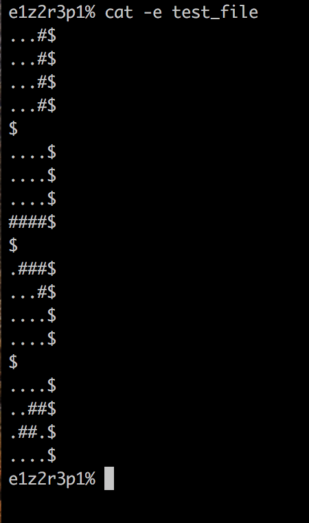
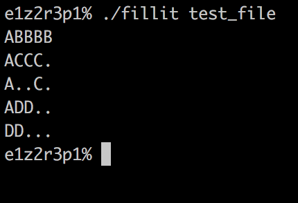

# Fillit
Searching the optimal solution among a huge set of possibilities, in a respectable timing

#

#

## Usage
    usage: fillit input_file

## Mandatory part

### Program entry:  
###### Executable must take only one parameter, a file which contains a lit of Tetriminos to assemble.
- Precisely 4 lines of 4 characters, each followed by a new line (a 4x4 square).
- A Tetrimino is a classic piece of Tetris composed of 4 blocks.
- Each character must be either a block character('#') or an empty character('.').
- Each block of a Tetrimino must touch at least one other block on any of his 4 sides (up, down, left and right)
    
### The smallest square:
###### Arrange every Tetriminos with each others in order to make the smallest possible square.
    
### Program output:
###### Display the smallest assembled square on the standart output.To identify each Tetrimino in the square solution, assign a capital letter to each Tetrimino, starting with 'A' and increasing for each new Tetrimino.
